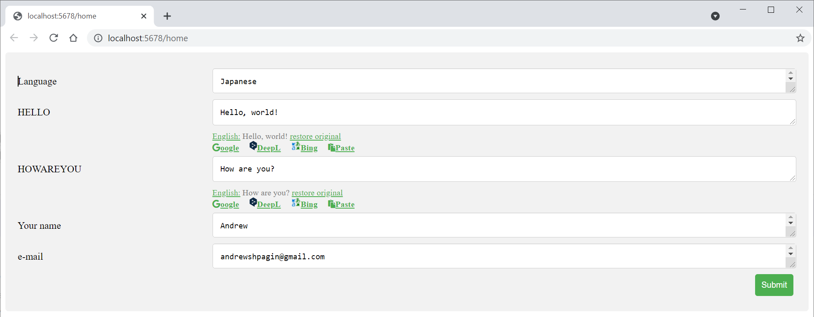

# idTranslate


The easy-to-use, dependency-free, cross-platform utility to translate/edit text used in your c++ application. Uses **[JccUI](https://github.com/AndrewShpagin/jccui)**.

## The problem it solves:
1. You have application, written using c++. It has text lines. Each text in program has own identifier.
2. You need the system to correct text, check grammar, translate to other languages, give users possibility to correct texts.
3. So, you have 3 values for each text item
- ID - the identifier of the text item
- EnglishText - the English text that corresponds to the ID
- LocalizedText - the text translated to some language. Initially it is the same as English.
4. User (or stuff member) press some hotkey over UI item. You get (from your internal structures) the ID, EnglishText, LocalizedText.
5. Now you are using this framework to open the page in the default browser. The page looks like:

**What is most important, the form opens in browser, so online grammar checkers like Grammarly are accessible, so your texts will always be good and clean with this system.**
6. User modifies texts, presses **submit**. 
7. You getting the modified text items.

## Implementing into your project
This is super easy. No external dependencies. Just include the header. Pay attention, you need to include 4 headers into your project: httplib.h, json.h, jcc.h, tServer.h. There is the example of the code:
```cpp
#include "tserver.h"

int main()
{
	///  First, create the translation server, you need to do it once.
	translate::tServer tr("public/edittext.html", 5678);
	/// Setup the translation callback. Pay attention, it may be called in the separate thread, 
	/// so be careful with the multithreading issues.
	tr.onTranslate([](const json::JSON& res) {
		std::cout << "Got translation:\n" << res.dump();
	});
	
	/// The next commands, addText ...show may be repeated many times asyncronously.
	/// Add texts to the translation queue
	tr.addText("HELLO", "Hello, world!", "Hello, world!");
	tr.addText("HOWAREYOU", "How are you?", "How are you?");
	/// Show the translation dialog
	tr.show("Andrew", "andrewshpagin@gmail.com", "Japanese", "ja");
	///Just wait.
	Sleep(2000);
	std::system("pause");
	return 0;
}
```
You will get in the console:
```
Got translation:
{
  "AUTHOR" : "Andrew",
  "EMAIL" : "andrewshpagin@gmail.com",
  "HINT:HELLO" : "Hellow, world!",
  "HINT:HOWAREYOU" : "How are you?",
  "Language" : "Japanese",
  "action" : "Submit"
}
```
